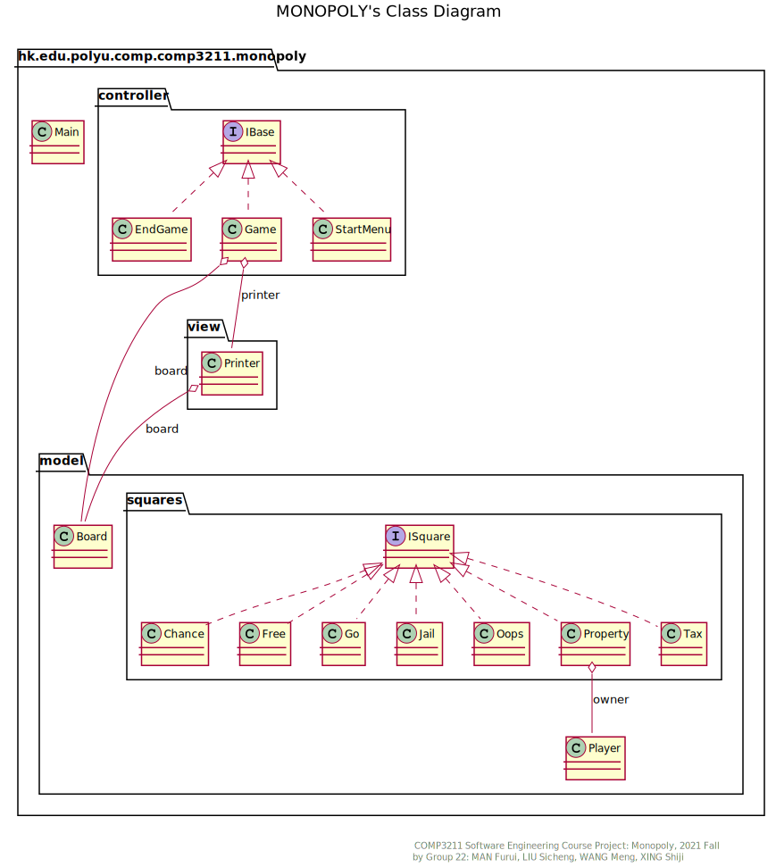
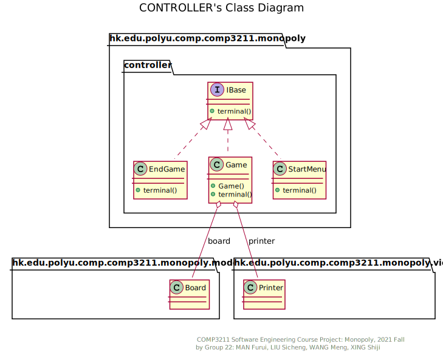
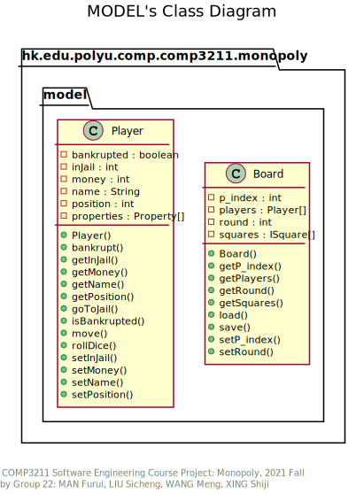
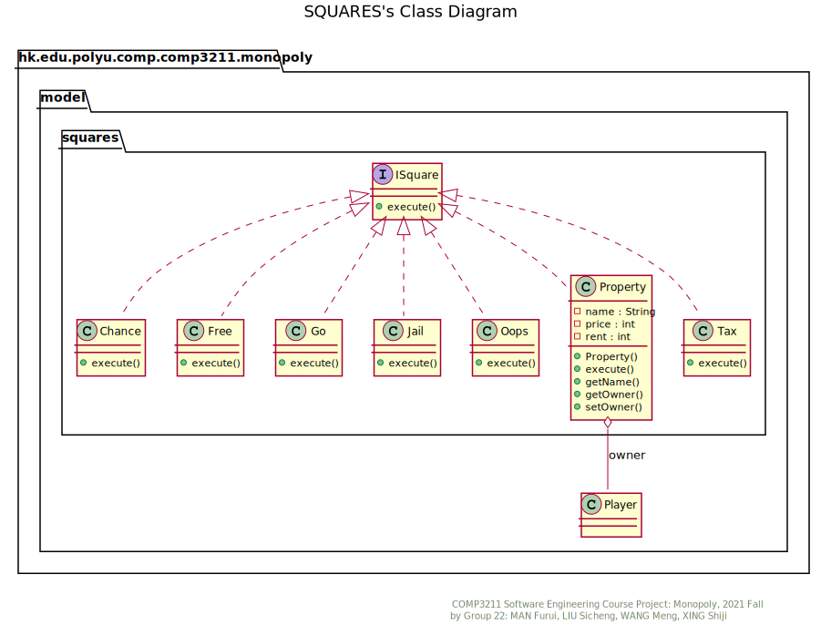
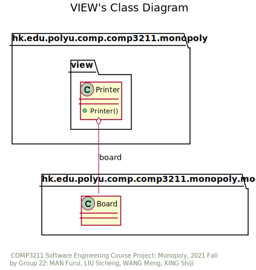

# Design Highlights

This document mainly illustrates important design decisions of the architectures of the product.
The product is implemented following the MVC model. However, since the product is based on command line, basic prompts are implemented in controller model, while the printing of the game board is handled in a specific class in view model.

## Main

The entry point of the application. A globally-shared scanner is defined in this class for other classes to use. The main control flow of `Main()` is calling the `terminal()` methods of different controller interface in a infinite while loop. Different controller handles different scenarios in the application, such as start menu, in game and end game. At the beginning of the application, `Main()` will create a StartMenu controller interface and pass the control to it. Detailed description of controller class will be noted in the controller section.

## Controller

All classes in this model should implement the interface IBase, which has a method void `terminal()`. this method is called by `Main()` in a infinite loop, and is designed to process one or more user inputs at a time. Several classes are defined implementing this interface, and they are used in different interfaces. Specifically, `StartMenu.terminal()` is called when the game is in start menu, and `Game.terminal()` is called when it is in the middle of a game. Same applies to `EndGame.terminal()`, when a game ends. The Main class will have a reference to the current interface, and this can be changed by controller classes in order to perform interface switching.

## Model

This section defines the model of the application, in which there are several significant components, namely the board, the square, and the player, implemented respectively by classes under the same reference. Details of each component class are covered in its corresponding section.

### Board

This class stores the information of the game. It keeps an array of players and an array of squares. The layout of the board (along with its functionalities) is initialized in the constructor and is stored in the array of squares. Furthermore, it also records the round of the game and current actioning player. The board also supports saving and loading to/from local file.

### Squares

The basic unit of map. All subclasses should implement the interface ISquare, which has one method void `execute(Player player)`. The method is called to perform specific operations on the current user stepping on the square. The following classes implements this interface: Chance, Free, Go, Jail, Oops, Property and Tax. The name of classes correspond to the type of squares in Appendix B of the group project document. Note that class Oops refers to the square "Go to Jail".

### Player

The class storing information about players. It should store players' name, money, current position, jail state, etc. In addition, it should supports auxiliary methods that adds money, moves forward in the map, teleport to Jail and rolls the dice. Moreover, it should have a `Property[]` array to store the properties owned by the player.

## View

The model only contains one class `printer`, which is used to print out the game board during rounds.
